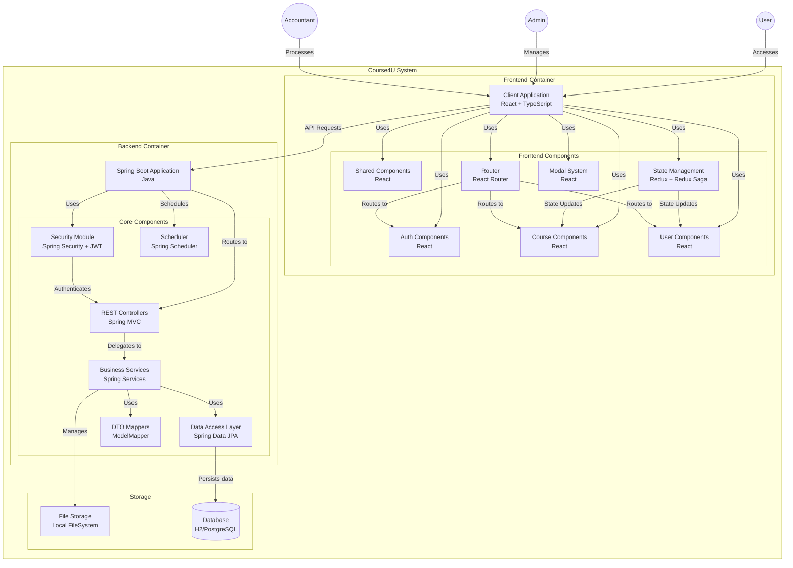

# 📌 Course4U - Web Application - ReactJS & Java Spring Boot

## 📖 Giới Thiệu

Course4U này là một ứng dụng web full-stack được phát triển bằng **ReactJS** cho frontend và **Spring Boot** cho backend. Ứng dụng cung cấp các chức năng như quản lý người dùng, quản lí khóa học, quản lí đơn đăng ký, quản lí chứng chỉ và bằng chứng thanh toán, xác thực, và tích hợp API.
Có 3 role chính: User, Admin và Accountant.

## ✨ Công Nghệ Sử Dụng

### **Frontend** (ReactJS)

-   ReactJS với TypeScript
-   UI: Shadcn, Ant Design, TailwindCSS
-   State Management: Redux Toolkit
-   Giao tiếp API: Axios
-   Build Tool: Vite.

### **Backend** (Spring Boot)

-   Spring Boot 3.x (Java 17/21)
-   Spring Security (JWT Auth)
-   Spring Data JPA (PostgreSQL)
-   RESTful API
-   Swagger API Documentation
-   Persistence: Liquibase
-   Unit-Test: Spock framework + Groovy
-   Code Coverage: Jacoco
-   Build tool: Gradle

### **DevOps & CI/CD**

-   Docker & Docker Compose
-   Jenkins Pipeline
-   Nginx Reverse Proxy
-   Traefik

### **Version Control**

-   Git
-   BitBucket as hosting server
-   Auth: JWT, OAuth2 with our simple solution.

---

## 📸 Hình Ảnh Minh Họa


Update Later...
---

## 📂 Cấu Trúc Thư Mục

```
Update later...
```

---

## 🚀 Cài Đặt & Chạy Dự Án

### 1️⃣ Cài Đặt Frontend

```bash
cd client
npm install
npm run dev
```

### 2️⃣ Cài Đặt Backend

```bash
cd server
./mvnw spring-boot:run
```

### 3️⃣ Chạy bằng Docker

```bash
docker-compose up --build
```

---

## 📌 API Documentation (Swagger)

Sau khi khởi chạy backend, truy cập [http://localhost:8080/swagger-ui.html](http://localhost:8080/swagger-ui.html) để xem tài liệu API.

---

## 🔥 Các Tính Năng Chính

✅ Authentication & Authorization (JWT)
✅ Quản lý người dùng (CRUD API)
✅ Giao diện thân thiện, hiện đại với TailwindCSS & Ant Design
✅ Kết nối Frontend & Backend qua Axios
✅ CI/CD với Jenkins & Docker

---

## Đối tượng sử dụng

-   Các công ty đang muốn khuyến khích nhân viên phát triển kĩ năng cá nhân, quản lý đơn đăng ký khóa học online và minh chứng hoàn thành khóa học (hóa đơn, chứng chỉ) để hoàn tiền cho các nhân viên đã hoàn thành khóa học. Đồng thời đây cũng là 1 nền tảng để các nhân viên chia sẻ chất lượng khóa học, recommend những khóa học hay để mọi người cùng phát triển.

## Các chức năng:

-   Đăng nhập/đăng ký
-   Đăng ký khóa học online ở trên nền tảng thứ 3 hoặc ngay trên nền tảng Course4U. Đối với các khóa học thuộc các nền tảng nối tiếng **Udemy**, **Coursera**, **Linkedln**,.. thì bạn có thể tạo đơn đăng ký, hoặc khóa học đơn giản bằng đường link dẫn đến, thông tin sẽ tự được fill.
-   Quản lý Course (các khóa học), Registration (Đơn đăng ký khóa học), Chứng chỉ, hóa đơn thanh toán khóa học nhằm mục đích nhận hoàn tiền.
-   Theo dõi tiến độ hoàn thành khóa học.
-   Sau khi hoàn thành khóa học, có thể nộp minh chứng để yêu cầu hoàn tiền cho khóa học.

---


